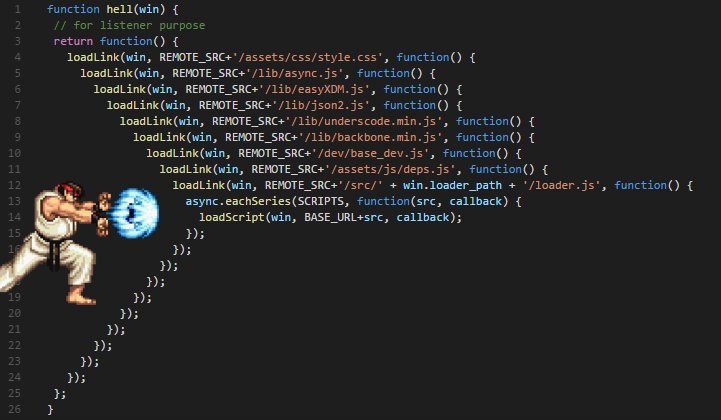

## Capacitação de Javascript

1. O que é javascript?
    É uma linguagem de programação rs,
    Ela é utilizada nas tecnologias web por ser exotica
    da para fazer muita coisa ruim.

    Se deseja aprender javascript pra valer, tem alguns livros/sites que recomendo:
    [Javascript Eloquent](https://eloquentjavascript.net/)
    [javascript.info](https://javascript.info/)
    [you dont know js](https://github.com/cezaraugusto/You-Dont-Know-JS)
    [aprenda rapido com flavio copes](https://drive.google.com/drive/folders/1j2m1RLY-ZHRTiUatCpBZGDc8t1ff74_x)
    [apenas um livro do flavio porem no medium](https://medium.freecodecamp.org/es5-to-esnext-heres-every-feature-added-to-javascript-since-2015-d0c255e13c6e)
    [js the right way](http://jstherightway.org/pt-br/)

    isso não tem nenhuma ordem, é seu dever avaliar se serve para você e qual o melhor,
    se você prefere lê ou aprende vendo os outros

2. O que é o ES5 ou ES6 ou ES7 ou ES2019 ou ES2020
    No começo do javascript ele foi criado para coisas simples, não pensaram que seria usado para tudo
    como é hoje em dia, como  foi uma coisa interessante outras empresas copiaram, o netscape tinha a invenção,
    a micro soft criou o JScript, a macromedia(e adobe) tem o actionscript, e com essa diversidade houve a
    necessidade de se ter um padrão, que é a organização do ECMA

    Por curiosidade, o primeir nome do linguagem era mocha, depois mudou para javascript por marketing
    e hoje em dia é ecmascript

3. Agora é pra valer: Variaveis no javascript
    Para testar as coisas ditas, executa os arquivos do lado com o node

    ```bash
     $ node nome_do_arquivo
    ```

    O javascript tem três paralavras chaves criar ligações(ligações == variaveis)
    são elas: `var`, `const`, `let`. <br>
    o `var` é recomendado não utilizar por deixar a variavel no escopo global
    além de ter comportamento diferente da maioria das outras linguagens
    e ter algo chamado [hoisting](https://www.google.com/url?sa=t&rct=j&q=&esrc=s&source=web&cd=1&cad=rja&uact=8&ved=2ahUKEwiN9_Gatb3lAhUMErkGHV8AAkAQFjAAegQIABAB&url=https%3A%2F%2Fdeveloper.mozilla.org%2Fpt-BR%2Fdocs%2FGlossario%2FHoisting&usg=AOvVaw2e7PmwoRUy31kl2TPlD5Ie).

    > exemplos no arquivo 1 <br>

    O var tambem não tem escopo, assim se vc colocar o `i` dentro do for,
    esse `i` será acessado de fora tambem

    > exemplos no arquivo 2 <br>

    além do var tem o `let` e o `const`
    eles criam ligações, porém não sofrem com o hoisting e tem escorpo normal
    a diferença entre let e const é que let pode ser reatribuido e const não

    ```javascript
        let vetor = []
        vetor = 9
        // tudo certo
        const pessoa = {
            nome: "thebestLucc"
        }
        const pessoa = {
            nome: "h."
        }
        // da erro por tentar reatribuir pessoa

        // porém vc pode mudar as estruturas de dentro da "constante"

        pessoa.nome = "Jan"
    ```
4. Curto circuito
    O que são operadores de curto circuito?
    são os && e o ||

    eles dão curto nas operações
    ```javascript
    if(true && true)
        alert('ola')
    ```
    aqui ele vai verificando o resultado e retornando um valor

    ```javascript
    true && true
    ```
    ele verificou que o primeiro valor é verdadeiro, se sim foi pro proximo, e verificou
    ele vai indo pro proximo até encontrar um valor falso, ou chegar no fim
    e assim retorna o valor encontrado primeiro, ou falso ou o valor do fim
    no if ele encontrou um valor verdadeiro e retornou

    ```javascript
    if(true && false && true)
        alert('ola')
    ```
    ele encontrou o false primeiro, retornou e o if quebrou

    ```javascript
    if(true && true && 20)
    ```
    ele foi até o fim e retornou o 20, como o if precisa de valor booleano, a javascript converteu ele
    para booleano e assim passou no if já que 20 é um valor trully
    sobre valores trully e falsy [Entendendo trully e falsy values](https://www.google.com/url?sa=t&rct=j&q=&esrc=s&source=web&cd=2&cad=rja&uact=8&ved=2ahUKEwifq7jPvL3lAhVDHbkGHUgQBBIQFjABegQIChAF&url=https%3A%2F%2Fstackoverflow.com%2Fquestions%2F35642809%2Funderstanding-javascript-truthy-and-falsy&usg=AOvVaw1Ggiu0wEdm0ENXmymGPM78)

    Com o `||` é uma logica parecida, porém ele procura o primeiro valor verdadeiro(true)

    ```javascript
    if(false || 0 || true || '')
    ```

    E esse comportamento é bastante interessante já que ele não depende do if para funcionar
    assim podemos ter logicas booleanas em "one line" sem utilizar if
    e o mais importante é que são expressões o que ajuda no react que aceita apenas expressões
    dentro da renderização dos componentes

    ```javascript
    const existe_algo = pessoa1 || pessoa2
    ```

    se `pessoa1` for um valor com nada dentro o valor de `existe_algo` será pessoa2
    caso contrario será `pessoa1`

    ```javascript
        variavel_com_valor_verdadeiro && executaFuncaoApenasSeValorForTrue()
    ```


5. Desestruturação

    Algo que serve mais como perfumaria, mas é bastante interessante(e bonito) é a desestruturação.
    Ela serve para fazer ligações rapidas(ligações são as famosas variaveis)

    ```javascript
    const [ primeiro, segundo ] = vetor
    ```

    isso é a mesma coisa disso:

    ```javascript
    const primeiro = vetor[0]
    const segundo = vetor[1]
    ```

    da até para trocar variaveis que nem no python

    ```javascript
    let a = 5
    let b = 90

    [b, a] = [a, b]
    ```

    O que ocorre acima, é que foi criado um vetor com dois valores, e com a desestruturação
    os valores foram logo reatribuidos

    tambem pode fazer desestruturação com objetos

    ```javascript
    const { nome, idade } = pessoa
    ```

    A diferença é que obrigatoriamente é necessario utilizar o nome da propriedade
    dentro do objeto, enquanto com o vetor voce atribui o nome que desejar

    Caso deseje utilizar um nome diferente pode fazer um named desestructuring

    ```javascript
    const { nome, idade: anos } = pessoa
    ```

    mais informações em: [destructuring assignment](https://javascript.info/destructuring-assignment)

6. Funçoes

    No javascript as funções são de "alta ordem", ou melhor Higher-Ordem, isso significa
    que elas são valores e podem receber outras funções como parametros, ou retornarem funções,
    uma função pode se comportar como os outros valores da linguagem

    Em relação a função ser um valor é por ela ser atribuida a uma variavel i.e:

    ```javascript
    let launchMissiles = function() {
        missileSystem.launch("now");
    };
    if (safeMode) {
        launchMissiles = function() {/* do nothing */};
    }
    ```

    Assim por que não colocar ela como parametro de outra função?

    ```javascript
    function repeat(n, action) {
        for (let i = 0; i < n; i++) {
            action(i);
        }
    }

    let labels = [];

    repeat(5, i => {
        labels.push(`Unit ${i + 1}`);
    });

    console.log(labels);
    // → ["Unit 1", "Unit 2", "Unit 3", "Unit 4", "Unit 5"]
    ```

    Então eu posso criar uma função dentro de outra função? Sim
    E tambem pode retorna uma função dentro de outra, e fazer o famoso curryng
    que é nada mais que dividir os parametros de uma função entre varias

    ```javascript
    function maiorQueNormal(x, y) {
        return x > y
    }

    function maiorQueCurryng(x) {
        return y => x > y
    }

    const maiorQue10 = MaiorQueCurryng(10)
    console.log(maiorQue10(2)) // → false
    console.log(maiorQue10(11)) // → true
    ```

    O livro javascript Eloquent tem dois capitulos para falar sobre funções, caso tenha
    curiosidades recomendo a leitura

    e terminando sobre desestruturação, ela pode ser feita em qualquer lugar
    onde se recebe algum valor, incluindo nos parametros da função

    ```javascript
    function algumaCoisa({ portas, rodas}, [primeiroElemento, segundoElemento]) {
        // faça algo incrivel aqui
    }

    const users = [
        { user: "Name1",geo:{lat:'12',long:'13'} },
        { user: "Name2",geo:{lat:'12',long:'13'}, age: 2 },
        { user: "Name2",geo:{lat:'12',long:'13'} },
        { user: "Name3",geo:{lat:'12',long:'13'}, age: 4 }
    ];

    for (const { user, age = "DEFAULT AGE" } of users) {
        console.log(user, age);
    }
    ```

7. Os 3 pontinhos ...

    Esses 3 pontinhos podem significar duas coisas, que são o Rest e o Spread

    O rest é uma forma de receber diversos argumentos numa função(ou numa desestruturação)

    ```javascript
    function somar(...parametros) {
        console.log(parametros typeof [])
        // resto do code
    }

    const [person1, person2, ...vetorComRestoDasPessoas] = vetorAleatorio

    const { nome, ...objetoComORestoDasPropriedades } = peson1
    console.log(nome) // → Caneta Azul
    ```

    Já o spread, é uma forma mais bonitinha de escrever duas funções, que são o 
    array.concat e o Object.assign, o que essas funções fazem é juntar os elementos

    ```javascript
    let arr = [3, 5, 1];
    let arr2 = [8, 9, 15];

    let merged = [0, ...arr, 2, ...arr2];
    // merged = [].concat([0]).concat(arr).concat([2]).concat(arr2)

    alert(merged); // → 0,3,5,1,2,8,9,15 (0, then arr, then 2, then arr2)

    let str = "Hello";

    alert( [...str] ); // → H,e,l,l,o
    ```

    E com objetos como mostra abaixo: 

    ```javascript
    let dados1 = { cidade: "Sao Paulo", aonde: "capital" }
    let dados2 = { população: "Enorme", he: "ha" }

    let dados juntos = {...dados1, ...dados2, he: "ho"}
    // Object.assign({}, dados1, dados2, { he: "ho" })
    ```

    neste exemplo mostra a utilização do campo `he` duas vezes, assim o valor do ultimo prevalece
    no caso `"ho"`

8. Assincronicidade

    Algo bastante comentado sobre o javascript é a assincronicidade, saiba que ela não tem nada de
    especial, o javascript não introduziu nenhum conceito novo, apenas trabalha a nivel de linguagem
    sendo async, e tendo formas de trabalhar com isso, desde estruturas de dados avançadas até 
    palavras chaves para tratar isso.

    Explicando o problema de se trabalhar com atividades assincronas, é que você não sabe quando
    algo será feito, e não pode fazer o programa esperar até isso ser feito se não ele ficara travado
    principalmente no browser, imagina que ruim seria se a pagina do usuario estivesse travada, porque
    o javascript está esperando o servidor responder com os dados

    No javascript existe 3 patterns de se trabalhar com atividades assincronas, que são:
    Callback, Promises e Async await

    - Callback
        ```javascript
        const dadosEscondidos = [
            { user: "Name1",geo:{lat:'12',long:'13'} },
            { user: "Name2",geo:{lat:'12',long:'13'}, age: 2 },
            { user: "Name2",geo:{lat:'12',long:'13'} },
            { user: "Name3",geo:{lat:'12',long:'13'}, age: 4 }
        ];

        function buscarDados() {
            setTimeout(() => {
                return dadosEscondidos
            }, 5000)
        }

        const usuarios = buscarDados()
        console.log(usuarios[0]) 
        //  console.log(usuarios[0])
        //                       ^

        //  TypeError: Cannot read property '0' of undefined
        ```

        > Este codigo esta no arquivo3.js, execute no terminal com o comando: node arquivo3.js

        Deu erro nesse exemplo pois o javascript não espera uma atividade terminar para continuar
        o codigo, logo ele executou o console.log antes da função `buscarDados` terminar.
        Uma solução para isso é usar callback, que é apenas o fato de colocar uma função
        como parametro da função `buscarDados`, e assim a função `buscarDados` executa esta 
        função de parametro quando os dados estiverem prontos:

        ```javascript
        function buscarDados(callback) {
            setTimeout(() => {
                callback(dadosEscondidos)
            }, 5000)
        }

        buscarDados(usuarios => {
            console.log(usuarios[0]) 
        })
        ```

        > Este codigo esta no arquivo4.js, execute no terminal com o comando: node arquivo4.js

        Está solução prevaleceu por bastante tempo, porém ela é simples e dificil de manter 
        a manuntenção do codigo quando o mesmo cresce, por você ser obrigado a codificar dentro
        da callback, mas se você necessitar de outra atividade assincrona, utilizar outra callback 
        dentro desta callback, e depois pode precisar de outra callback, e chega num momento que é
        conhecido como callback hell (onde é dificil de pensar e entender sobre o codigo)

        

        [callbackhell.com](http://callbackhell.com/)

    - Promises

        A solução para melhorar a forma de se trabalhar com as atividades assincronas foi as
        promisses, que é um pattern de uma estrutura de dados que ajuda a retirar o callback hell
        além de trazer outras soluções, hoje em dia o javascript tem um objeto Promises para 
        trabalhar com isso, mas saiba que não é algo novo, as Promises tambem conhecida como futures
        em outras linguagens é uma solução antiga para o mesmo problema, sendo conhecida desde 
        1990 e pouco, e você mesmo pode implementar a sua (claro que a nativa da linguagem tem
        melhorias de peformance conectado com o motor do javascript).

        ```javascript
        // a função buscarDados retorna uma promise
        function buscarDados() {
            // O construtor de Promise recebe uma função como parametro iremos chamar de função [[A]]
            // essa função tem duas funções como parametro, que são [[resolve]] e [[reject]]
            // você faz o codigo da atividade assincrona dentro da função [[A]], o resultado da
            // atividade assincrona você executa a função [[resolve]] e passa o resultado ta atividade
            // assincrona para essa função
            // caso tenha dado algum erro, execute a função [[reject]] e passe o erro para ela
            return new Promise((resolve, reject) => {
                setTimeout(() => {
                    resolve(dadosEscondidos)
                }, 5000)
        
                // se tivesse dado erro
                // reject(erro aqui)
            })
        } 

        buscarDados()
            .then(resultado => resultado[0])
            .then(resultado => console.log(resultado))
            .catch(erro => console.error(erro))
        ```

        > Este codigo esta no arquivo5.js, execute no terminal com o comando: node arquivo5.js

        Perceba que aqui passamos a antiga callback para a função `then`, porém a diferença de como
        se fazia antes, é que o resultado retornado por essa função pode é passado para o parametro do
        proximo `then`, veja que no codigo retornei no primeiro `then` o primeiro elemento do vetor,
        e assim utilizo ele no proximo `then`.
        Outra feature interessante é o tratamento de erro, enquanto antes era necessario tratar o
        erro dentro de cada callback, aqui podemos the um `catch`, de uma vez só, casso ocorra
        um erro dentro de qualquer `then`, o `catch` é executado

    - Async await

        Já estava tudo perfeito? mas tem como melhorar :sunglasses:
        o async await é uma abstração da linguagem feita em cima das Promises, para fazer os codigos
        com promises serem programados igual codigos sincronos, sendo uma feature copiada do C#.
        A Microsoft é dona do C# e do typescript, e o javascript tem forte influencia das features do
        typescript (i love typescript :heart:)

        Mas como isso funciona????
        Eggxamples: 

        ```javascript

        // aqui estamos usando a versao de promise da função buscarDados

        async function main() {
            try {
                const resultado = await buscarDados()
                const pessoa = resultado[0]
                console.log(pessoa)
            } catch(erro) {
                console.error(erro)
            }
        }
        main()
        ```

        > Este codigo esta no arquivo6.js, execute no terminal com o comando: node arquivo6.js

        O que ocorre aqui é um syntax sugar, é como se com o await, ele coloca-se tudo que tem nas 
        linhas de baixo dentro de um `then`, e o codigo fica parecido com codigo sincrono.
        Veja que o erro foi trado no catch lá embaixo do try catch
        A palavra chave await só pode ser executada dentro de funções async, e funções async são 
        automaticamento tranformadas em Promise, ou seja poderiamos fazer isso:

        ```javascript
        async function main() {
            const resultado = await buscarDados()
            const pessoa = resultado[0]
            console.log(pessoa)
            
        }
        main()
            .catch(console.error)
        ```

        Curiosidade: para o ano de 2020 será lançada a feature top level await, que é o fato de poder
        utilizar await sem estar dentro de uma função async mais aqui: [top level await](https://v8.dev/features/top-level-await)

    Caso tenha curiosidades e deseja saber mais, além dos conteudos que passei lá no começo que tem
    capitulos exclusivos para esse assunto, tambem tem uns artigos otimos do Lucas Santos que trabalha
    bastante bem em cima disso [Entendendo promises de uma vez por todas](https://www.google.com/url?sa=t&rct=j&q=&esrc=s&source=web&cd=1&cad=rja&uact=8&ved=2ahUKEwjkkbLn7s_lAhVvGbkGHZPCBAYQFjAAegQIABAB&url=https%3A%2F%2Fmedium.com%2Ftrainingcenter%2Fentendendo-promises-de-uma-vez-por-todas-32442ec725c2&usg=AOvVaw3yTbca_pvAO_wqFrrCz-JQ)

9. Utilizando a fetch API

    agora que você ta ficando avançado, irei mostrar como utilizar a fetch API, que é uma função
    dos navegadores para fazer requisições pela internet e que utiliza promises, é bem mais facil e 
    melhor de trabalhar do que a forma antiga utilizando o xhtmlrequest com ready state (sendo que essa
    função é uma abstração sobre isso)

    vamos buscar um dado da internet

    ```javascript
    const url = "https://www.jsonstore.io/6b54c9fcbf378230422f33138acff270ee510bd02cdf2d046b65305d7197a3b7"

    async function main() {
        const rawResult = await fetch(url)
        const resultado = await rawResult.json()
        console.log(resultado)
    }
    main()
    ```

    > Este codigo esta no arquivo7.js, execute no terminal com o comando: node arquivo7.js
    > para executar ele será necessario instalar as dependencias com yarn ou npm

    Com isso você terá o necessario para entender e utilizar boa parte dos codigos modernos do javascript,
    mas ainda tem outras coisas interessantes para se vê como string literals, tentei ser sucinto e trazer
    apenas o necessario, sei que o objetivo de quem lê é entender um pouco e aprender, e não virar ninja

    obrigado, :octocat: :squirrel:
